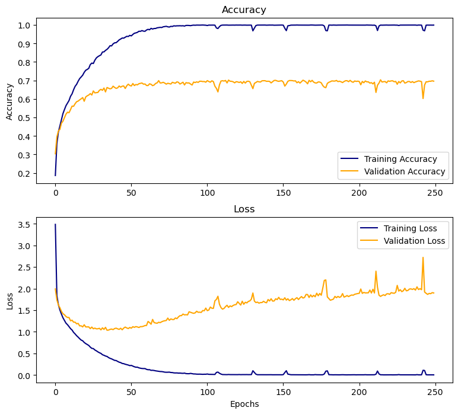

#  Project 5 - Group Project: Music Genre Classification

### Problem Statement

Developing a machine learning model for music genre classification from audio files is a challenging task due to the high dimensionality of audio signals and the variability of music genres. The objective of this project is to develop an accurate and scalable music genre classification model that can handle large-scale datasets and generalize well to new, unseen songs. This will involve exploring various feature extraction techniques and machine learning algorithms, evaluating the model's performance on a test set, and ultimately delivering a high-performing model that can be integrated into Spotify's music recommendation system.

### Background

As a team of data scientists working at Spotify, our mission is to enhance the user experience of our music streaming platform. One way to achieve this is to provide accurate and personalized music recommendations to our users. One crucial aspect of personalized music recommendations is accurate genre classification of music tracks. While traditional manual genre labeling can be time-consuming and often subjective, an automated model that can recognize the genre of music by analyzing its sound characteristics could be a valuable tool for our platform.

Over the years, many approaches have been developed for automatic genre classification of music, including rule-based systems, feature-based models, and deep learning-based models. While rule-based systems rely on manually defined rules, feature-based models extract relevant features from the audio signal and classify the music based on these features. Deep learning-based models, on the other hand, learn hierarchical representations of the audio signal using neural networks and can achieve state-of-the-art performance in genre classification tasks.

In recent years, deep learning-based models have shown promising results in music genre classification tasks. For instance, convolutional neural networks (CNNs) have been used to extract time-frequency representations of music signals and achieve high accuracy in genre classification tasks. 

However, there is still room for improvement in the accuracy and efficiency of music genre classification models. One key challenge is the variability and diversity of music styles and sub-genres. Moreover, the robustness of these models to background noise, compression artifacts, and other forms of audio degradation is also an important consideration in real-world scenarios.

Therefore, our goal as a data science team at Spotify is to develop an accurate and robust music genre classification model that can improve the music recommendation system on our platform and enhance the user experience.

---

### Datasets

The raw audio dataset is provided from [Kaggle](https://www.kaggle.com/datasets/andradaolteanu/gtzan-dataset-music-genre-classification) and are organized into genre subfolders. Each genre has its own folder that consists of one-hundred 30-sec samples of music.

The Spotify data was scraped from Spotify using the Spotipy API.

---

## Spotify Tabular Data Classification Models (non-CNN)

In this process of music genre classification with Spotify tabular data, we seek to make predictive models that do not rely on time frequency analysis. We will use Spotify's API in order to get song data to fit a logistic regression and a dense neural network to discern genre. This model will serve as another benchmark of success for our CNNs, a way to see how tabular data might serve for the purpose of this project.

### Data Collection, Preprocessing, and Exploratory Data Analysis (EDA)

We will be using the "Top 10,000 Songs of All Time" playlist by Aclaimed Music to create a data frame of features with which to fit our model. We chose this playlist simply because it allows us to get a verbose dataset with no knowledge of other individual playlists. Ideally we would want to filter through several playlists, then append to an existing dataset the songs in that new playlist that are already not present, but we lack a list of playlists. Something like the Million Playlists Dataset would be appropriate, but that requires entry to the Alcrowd competition, and this section isn't the focus of our project, we merely want to provide an alternate predictive model to compare our CNN to.

Below is 5 samples of the collected data used in the classification models.

The process, further detailed in the notebook, consists on making successive calls to extract the uri's of individual tracks from the playlist, utilising those uris to extract artist uris where genres are held, then indexing into the json response object of each call to extract song features with .get_audio_features() in order to cast it as a dataframe.

The data collection process using the Spotipy API is arduous and takes several days to fully collect all data. Because of this, data that was already collected for a similar task by Cameron Watts and his team laid out in his article "Extracting Song Data From the Spotify API Using Python".

From this data, we fit a logistic regression:

**Logistic Regression Model Accuracy: 0.479**

This model performs better than the base case, but is still not great. We're not trying to create the perfect logistic regression model, however, only provide alternative models with tabular data for comparison. Let us now try a dense net with this data set. Our net will have one input layer, one hidden layer and one output layer, with 30 nodes on both the enry and hidden layer, 8 output nodes:

**Dense Neural Netowrk Model Accuracy: 0.508**

There actually isn't a need to regularize our model, its not prone to overfiting. We could iterate further, incorparate batch sizing, dropouts and early stoppage as well as more layers in order to improve the overall score, but once again, that is not the aim of this project

### Conclusions
Using tabular data in order to classify music does provide an improvement over the base case. With further iteration these models could be improved. However, using this tabular data requires in and of itself music preprocessing to find the features used for fitting, which takes time and resources, and during this process the genre itself could be surmized with the preprocessing. The purpose of this project is to provide an easy to use model with which to classify lesser known artists. Below we will see how our CNN models do in comparison to these models.

---

## Audio Data Classification Models
### Data Collection, Preprocessing, and Exploratory Data Analysis (EDA)

Audio data can be a challenging format of data to work with, as it is disorganzied and there are many aspects that require detailed knowledge of digital signal processing (DSP). The following are the formats that the audio will take through the steps that are required to process the audio data demonstrated with a sample audio file from the dataset.

### Waveform
- The waveform of the data shows the oscillations of pressure amplitude over time. This is effectively the "raw" format of audio that a computer 
- It is defined by the sampling frequency and bit depth.
    - The sampling frequency refers to how many samlpes of audio are played back per second (i.e. 44.1kHz means that every second, 44,100 samples are played). This determines the upper bound of frequencies that can be represented by the audio signal.
    - The bit depth refers to how precise the amplitude values are determining the dynamic range of an audio signal (i.e. 16-bit depth can represent 65,536 unique numbers, resulting in approx. 96dB of dynamic range)
- To simplify, the sampling rate essentially controls the resolution of the x-axis and the bit depth controls the resolution of the y-axis

### Frequency Spectrum
- The spectrum of a waveform shows the magnitude (in dB) of the signal per frequency.
- Notice there is no time component here, rather the magnitude (db) is with reference to frequencies of the entire audio signal (in this case 30 sec clip)
- While the plot below shows the spectrum for the entire signal, we will be using this concept to take the spectrum of small pieces of the signal to reintroduce a time component when we create spectrograms next.

### Spectrogram
- A spectrogram is the combination of a waveform and spectrum plot, resulting in frequency magnitude (in dB) over time.
- It has been scaled so that 0 dB is the maximum value.
- Notice how patterns emerge in the light-green and yellow, looking like diagonal lines that move up and down. These patterns correspond to specific attributes of the music, such as melodies.

### Mel-Spectrogram
- The mel-spectrogram is similar to a spectrogram, except that the magitudes have been scaled to a "Mel-scale".
- This "Mel-scale' can be summarized with Mel Frequency Cepstral Coefficients (MFCCs).
- This is use in machine learning because it filters the data to somewhat more similar to how humans here and it provies a better format of the data for the algorithm to learn on.
- Additionally, the resolution can be drastically reduced and still retain important information. This can be thought of as a form of compressing the audio data.
- Below is a much higher resolution Mel-spectrogram than will be used in the model

Below is a sample of a Mel-spectrogram that will be input into the model. It is 3-seconds long and only utilizes 12 MFCCs (the mel-spectrogram above was using 128!).

### Preprocessing Summary
Data collection and preprocessing consists of three steps:
- Collect audio data and genres
- Convert audio to MFCCs
- Save MFCCs and genres to disk

During this process, the audio files are split into 3-second segments. Because neural networks needs a large number of samples to train on, this effectively increases the number of samples we will be able to feed into our network. Once all steps previously illustrated were complete, the data was ready to train the models.

---

## Modeling
- Two types of models were tested
    - Dense Neural Netowrk (DNN)
    - Convolutional Neural Network (CNN)
- For audio and image classification, CNNs typically outperform DNNs. Our testing confirmed this, so we worked with the CNN to improve it's performance through parameter tuning and regularization techniques.
- Additionally, data needs to be in the correct "shape" in order to input into certain models.
    - DNN: (n, n)
    - CNN: (n, n, 1)
- The data was split into 3 sets:
    - Training set: For the model to train on
    - Validation set: For the model to compare against while training
    - Test set: A set unsees by the model until the end for final testing
- We let all models run for 250 epochs to visualize where each hit their performance ceiling. With the final CNN model, the learning was a bit slower so we increased the epochs to 400 to achieve its optimal performance.

### Dense Neural Network (DNN)
- A Dense Neural Network consists of multiple dense layers ordered sequentially one after the other.
- An 'l2' regularization penalty was leveraged to help mitigate overfitting.
- Dropout layers were included to help mitigate overfitting.
- Dense neural networks are useful for some tasks, but often do not perform as well on image and audio data.
- As can be seen below, the model begins overfitting just past 100 epochs and reaches its optimal performance somwhere between 150 and 200 epochs.

**DNN Model Accuracy: 0.578**

### Convolutional Neural Network (Without Regularization)
- A Convolutional Neural Network (CNN) consists of a combination of convolution layers and dense layers.
- Convolution layers first begin to identify features within the data, similar to edge detection in image data.
- The the data is flattened out to run through dense layers to classify the data.
- A base CNN was tested without regulatization methods to establish a base performance before iterating through tuning parameters.
- As can be seen below, the model begins overfitting very early on, just past 20 epochs. It learns much faster and better than the DNN and reaches its optimal performance somewhere between 50 and 100 epochs.

**CNN-1 Model Accuracy: 0.691**

### Convolutional Neural Network (With Regularization)
- A Convolutional Neural Network (CNN) consists of a combination of convolution layers and dense layers.
- Convolution layers first begin to identify features within the data, similar to edge detection in image data.
- The the data is flattened out to run through dense layers to classify the data.
- The CNN below went through many iterations to tune regularization parameters. We included:
    - Dropout: Drops some nodes through each epoch to force all nodes to learn all features of the model. This helps reduce overfitting of the model.
    - Early Stopping: This stops the model once it has reached a certain threshold of no longer improving. This also helps reduce overfitting.
    - Regularization penalties (such as 'l2') were *not* leveraged for the CNN, as they do not improve the performance of the model.
- As can be seen below, the model begins overfitting very early on, just past 20 epochs. However, because of the regularization technique of implementing dropout, the learning speed is traded off with continued improvement. Because of this, it's optimal performance is reached somewhere between 200 and 250 epochs.

**CNN-2 Model Accuracy: 0.801**

### Convolutional Neural Network (With Regularization and Data Augmentation)
- This model is exactly the same as the previous CNN with regularization techniques implemented, with an addition of a data augmentation technique.
- Because the audio data has essentially been transcoded into something similar to an image, flipping the "image" can effectively add more diverse data for the model to train on. This flipping is analogous to feeding the audio clip through the model in reverse.
- Adding this diversity in data can improve the model without having to truly provide it more data.
- As can be seen below, the model begins overfitting very early on, similar to the other CNNs. It also continues improving like the CNN with regularization. The difference is that it learns a little slower, but keeps a closer range between the train and test data, allowing for an increase in overall performance.

**CNN-3 Model Accuracy: 0.838**

### Model Performance Summary
Below are the final accuracy scores for all models that were tested.
*NOTE:* All models were overfit, as is common with neural networks. However, we worked to balance overfitting the model with performance to ensure optimal performance on unseen data.

|**Model**|**Accuracy**|
|---|---|
|**DNN**|0.578|
|**CNN (Without Regularization)**|0.691|
|**CNN (With Regularization)**|0.801|
|**CNN (With Regularization and Data Manipulation)**|0.838|

---

### Conclusions

#### Audio Data Modeling Conclusions
In this notebook, 4 separate neural networks were trained:
1. Dense Neural Network (DNN)
2. Convolutional Neural Network (CNN)
3. Convolutional Neural Network with Regularization
4. Convolutional Neural Network with Regularization and Data Augmentation

A Dense neural network was tested as it is one of the simplest types of neural networks and is comparatively fast to train. However, when working with data such as this (audio or images), DNNs typically do not perform quite as well as CNNs due to their structure. So while a reasonable model can be created using a DNN, it does not perform as optimally as a CNN.

Convolutional neural networks were trained and iterated upon as they often perform better on audio and image data. Because we essentially transformed our audio data into something similar to an image, a CNN was the best choice for this dataset. We began with a base CNN structure and then continued adding features to improve the model. In addition to the base CNN, we added the regularization method of "dropout", which randomly drops nodes from the network to force each node to learn more broadly, ultimately reducing overfitting and improving generalized performance. Additionally, because the audio data has been transformed into something similar to an image, flipping this audio "image" (a.k.a. sending the audio through the model in reverse), diversifies the data the model was learning on. Each of these steps improved our performance.

Overall, the final CNN model has proven the ability to learn complex patterns in the audio features that are relevant for music genre classification. To allow for such an accurate performance, audio needs to be transformed into the appropriate format that works best with CNNs. This means that the audio must be transformed into what is similar to an image, like a "picture of audio".

#### Project Conclusions
Through these technical notebook reports, audio data was collected, processed, and used to train multiple classification models. Additionally, engineered audio feature data was scraped from Spotify to use in another classification model. These two separate methods were performed to demonstrate the different ways songs can be classified into genres of music.
- Utilizing pre-engineered features provided by Spotify, such as Liveness, Acousticness, Tempo, etc. to train a logistic regression and dense neural network model.
- Processing raw audio files to train a dense neural network and multiple convolutional neural networks.

Both methods have pros and cons.

The benefit of modeling using pre-engineered data is that the data is organized, can be easily manipulated, and the models require less time to train before predictions. Additionally, other types of models can be trained on tabular data such as this. However, performance sometimes can suffer when using pre-engineered features that you do not quite have a full understanding of how they were created. Additionally, it takes a significant amount of resources from Spotify to calculate these engineered features for every song.

The benefit of modeling with raw audio is that you have access to the source data and full control over how it can be manipulated. This leads to mode a more flexible model that can be fed any piece of audio and still attempt to classify it. Some drawbacks to this method though are there is more effort, computation, and knowledge required to process the audio data appropriately and models also take longer to train on this data type.

While both methods have their pros and cons, the final model presented in this notebook demonstrates that this method of audio processing and modeling is an effective means of audio classification.

### Recommendations

Based on our achievements in this model, outperforming models trained on Spotify's engineered audio features, we recommend that Spotify allocate more funding to further develop this convolutional neural network classification technology. Resources should be distributed to collect larger and more diverse data sets as well as continue to refine and improve the current model. In addition to classifying smaller or independent artists, this technology also could be leveraged for recommendation systems to generate playlists with similar artists or recommend new artists to users.

The following are some additional areas for potential improvement:
- Further optimizing hyperparameters such as the learning rate, batch size, and number of epochs
- Test different lengths of audio to train the model (i.e. 2 sec, 5 sec, 10 sec,). This model used 3 sec.
- Implement additional data augmentation techniques to increase the diversity of the training data
- Collect more data for the model to train on.